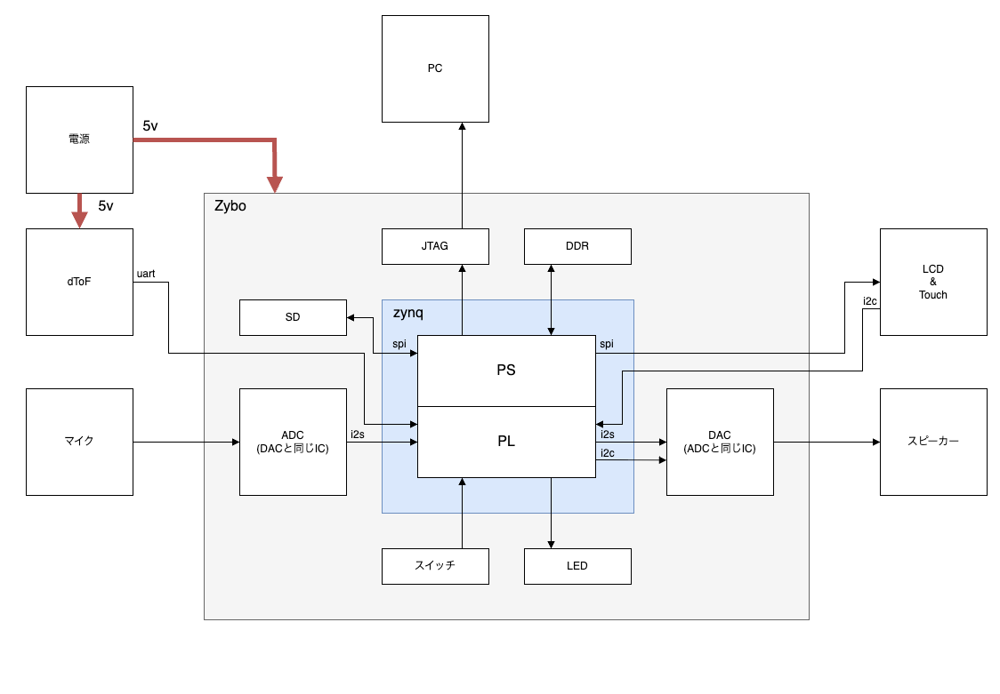
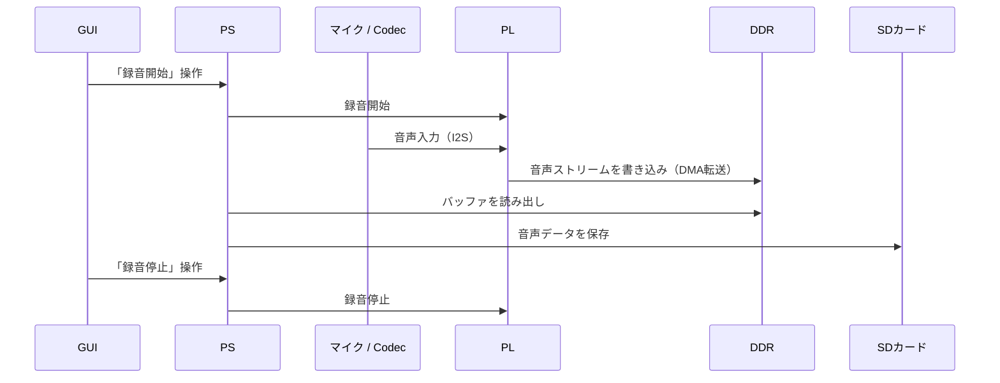
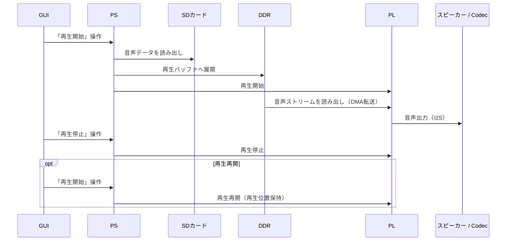
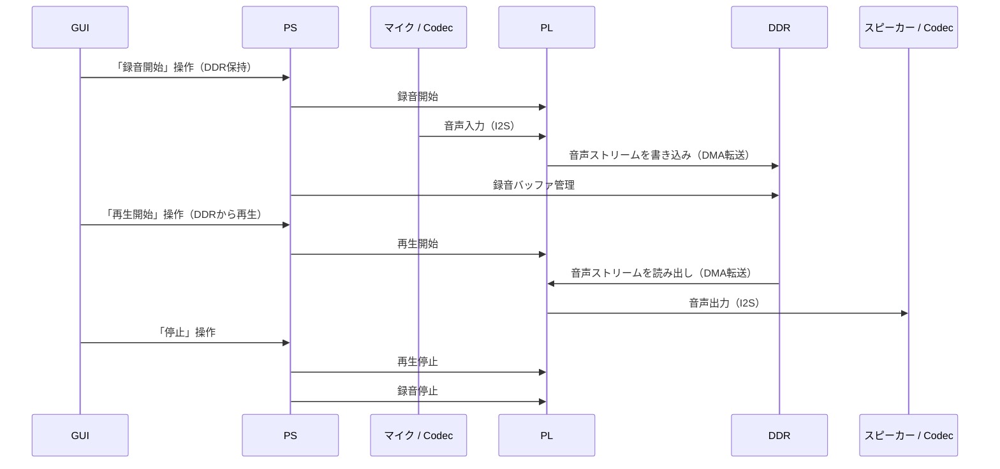

# VoiceNote

## 1. 概要
本リポジトリは、**Zynq SoCを用いた音声録音・再生システム**の設計/実装を管理する。\
VoiceNoteは、PL（Programmable Logic / FPGA）によるリアルタイム音声処理と、\
PS（Processing System / CPU）によるGUIおよびPL制御を組み合わせた\
Zynq SoCベースのオーディオシステムである。

本ドキュメントは**システム設計（要求仕様含む）の要約版**として位置付ける。

PS / PLの詳細設計については、以下のドキュメントを参照すること。

- 📘 [FPGA設計書](docs/system_design.md)
- 📗 [ソフトウェア設計書](docs/software_design.md)

---

## 2. 目的
- 学習・検証用途としてのZynq SoC活用事例
- それと、これを機に皆にZynqを使って欲しいから...

---

## 3. 要求仕様

本システムは、以下の要求仕様を満たすことを目的として設計されている。\
本章では**製作者視点での仕様**を示す。

### 3-1. 録音・再生仕様

| 項目 | 仕様 |
|---|---|
| 最大録音時間 | 30秒 |
| 最小録音単位 | 数十ms程度 |
| 再生方式 | ストリーム再生 / SD再生 |
| 録音開始方式 | 手動 / 自動（音声レベル判定） |
| 再生音量制御 | 距離連動 |
| 音声ファイル形式 | WAV |

### 3-2. 音声性能

| 項目 | 仕様 |
|---|---|
| サンプリングレート | 48kHz |
| 量子化ビット数 | 16bit |
| チャネル数 | 2ch |
| 内部処理方式 | ストリーム処理 |
| レイテンシ | 再生品質に影響しない範囲で許容数（数msオーダ想定） |

※ チャネル数は2chだが同じ音でも良い。\
※ 実際の性能は設定および実装により変動する。

### 3-3. 動作モードおよび制約

| 項目 | 仕様 |
|---|---|
| 録音と再生の同時実行 | 非対応（排他的に動作） |
| 動作モード | 録音モード / 再生モード |
| モード切替 | GUI操作により明示的に切替 |
| 録音中の停止操作 | 停止時点で録音を終了し、音声データを確定する |
| 録音の再実行 | 再度録音を開始した場合、新規音声として録音する |
| 再生中の停止操作 | 再生を一時停止する |
| 再生の再実行 | 停止した位置から再生を再開する |

※ 同時実行については、個人開発のため設計簡素化を考慮し、\
本システムでは録音と再生を排他的に動作させる設計とする。\
※ 再生位置を先頭に戻す操作（頭出し）は、将来拡張として別途検討する。

---

## 4. 用語一覧
本プロジェクトで使用する主な用語を以下に示す。
（一般的な用語については省略）

| 用語 | 説明 |
|---|---|
| PS | Processing System（ARM Cortex-A9を含むCPU側） |
| PL | Programmable Logic（FPGAロジック側） |
| PS / PL | Zynq SoCにおける論理的な構成区分 |
| FPGA / SW | 実装手段を示す用語（設計上の区分は PS / PL を優先する） |
| I2S | 音声用シリアルインターフェース |
| Audio Formatter | 音声用DMA IP |
| AGC | Automatic Gain Control |
| LVGL | 組み込み向けGUIライブラリ |

---

## 5. 全体構成

※ スイッチ、LEDについてはデバッグ用として使用する。\
そのため実動作としては使用しない予定。

### 5-1. 構成要素

#### SoM / SoC

| 項目 | 内容 |
|---|---|
| SoM | Zybo Z7-10 |
| SoC | AMD Zynq-7000 |
| PS | Arm Cortex-A9（Dual Core） |
| PL | Artix-7 |

#### Codec（ADC / DAC）

| 項目 | 内容 |
|---|---|
| デバイス | SSM2603 |
| インターフェース | I2S（音声） / I2C（制御） |
| チャネル数 | 1ch（出力は2ch） |
| 量子化ビット数 | 16bit |
| サンプリングレート | 48kHz |
| 入力 | マイク入力 |
| 出力 | ヘッドフォン出力 |

#### 測距センサ

| 項目 | 内容 |
|---|---|
| デバイス | TF-Luna |
| センサ種別 | dToF（direct Time of Flight） |
| インターフェース | UART |
| 測距範囲 | 200mm ～ 3000mm |
| フレームレート | 250Hz |

#### LCD / タッチパネル

**LCD**

| 項目 | 内容 |
|---|---|
| デバイス | ST7789 |
| 解像度 | 240 × 320 |
| インターフェース | SPI |
| 表示色 | RGB565 |

**タッチコントローラ**

| 項目 | 内容 |
|---|---|
| デバイス | CST328 |
| インターフェース | I2C |
| タッチ方式 | 静電容量方式 |

#### SDカード（micro）

| 項目 | 内容 |
|---|---|
| 対応規格 | SD / SDHC |
| スピードクラス | 4以上を推奨 |
| ファイルシステム | FAT32 |
| インターフェース | SDIO / SPI |
| 想定容量 | 最大4GB |

---

## 6. インターフェース一覧

本システムで使用している主なインターフェースを以下に示す。\
詳細はFPGA設計書およびソフトウェア設計書を参照すること。

### 6-1. 外部インターフェース

| 接続対象 | インターフェース | 用途 |
|---|---|---|
| Codec（SSM2603） | I2S | 音声入出力 |
| Codec（SSM2603） | I2C | レジスタ制御 |
| LCD（ST7789） | SPI | 画面表示 |
| Touch Controller（CST328） | I2C | タッチ入力 |
| dToFセンサ（TF-Luna） | UART | 距離取得 |
| SDカード | SDIO / SPI | 音声データ保存 |
| JTAG | UART | ログ出力 |

### 6-2. 内部インターフェース（PS-PL）

| インターフェース | 用途 |
|---|---|
| AXI4-Lite | レジスタ制御 |
| AXI4-Stream | 音声データ転送 |
| AXI4 | DDRとのDMA転送 |

---

## 7. システム機能一覧

本システムが提供する機能を以下に示す。\
本章では **「ユーザー視点 / システム視点で何ができるか」** に焦点を当て、\
機能の内部実装やPS / PLの責務分担については後続章で定義する。

### 7-1. 音声処理機能

- 音声録音
  - マイク入力からのリアルタイム録音
  - SDカードへの音声データ保存
- 音声再生
  - 保存済み音声データの再生
  - 再生中の一時停止および再開
- 自動録音
  - 入力音声レベルに応じた録音開始／停止の自動制御
- 音声処理
  - DCカット
  - 音質補正（ノイズ除去）
  - AGC（センサ連動）
  - 音声に対するエフェクト処理

### 7-2. センサ連動機能

- 距離取得
  - dToFセンサによる距離測定
- 距離連動制御
  - 距離情報に応じた再生音量の動的制御

### 7-3. ユーザーインターフェース機能

- GUI操作
  - 録音/再生/各種設定操作
- LCD表示
  - 状態表示
  - 再生中情報の可視化

### 7-4. システム制御・管理機能

- 音声ファイル管理
  - SDカード上の音声データ管理
- DMA転送
  - 音声データの高速転送
- 割り込み駆動制御
- デバッグ支援
  - UARTログ出力
  - GPIOによる状態可視化

---

## 8. 機能の責務分担

本章では、本システムを構成する主要機能について、\
PSおよびPLの責務分担を示す。

| 機能カテゴリ | 機能名 | PS (SW) | PL (FPGA) | 備考 |
|---|---|:---:|:---:|---|
| 音声入力 | 音声録音 | ⚪︎ | ⚪︎ | 制御・管理はPS、ストリーム処理はPL |
| 音声処理 | ARC（自動録音） | ⚪︎ | ⚪︎ | PSはレジスタ制御 |
| 音声処理 | DCカット | ⚪︎ | ⚪︎ | PSはレジスタ制御 |
| 音声処理 | ノイズゲート | ⚪︎ | ⚪︎ | PSはレジスタ制御 |
| 音声処理 | AGC（測距連動） | ⚪︎ | ⚪︎ | PSはレジスタ制御 |
| 音声処理 | 音声エフェクト | ⚪︎ | - |  |
| 音声出力 | 音声再生 | ⚪︎ | ⚪︎ | データ管理はPS |
| センサ連動 | 距離取得 | - | ⚪︎ | UART通信 |
| UI | GUI操作 | ⚪︎ | - | LVGL |
| UI | LCD表示 | ⚪︎ | - | SPI接続 |
| UI | タッチ制御 | ⚪︎ | - | I2CはPLのIPを使用 |
| システム | 音声ファイル管理 | ⚪︎ | - | FATFS |
| システム | DMA転送 | ⚪︎ | ⚪︎ | PLのIPを使用 |
| デバッグ | ログ出力 | ⚪︎ | - | UART |

※ PS / PLの両方が ⚪︎ の場合、\
制御・管理をPS、実時間処理をPLが担当することを意味する。

---

## 9. データフロー概要

本章では、音声データおよび制御情報のPS / PL間の流れを概要レベルで示す。\
詳細な仕様（AXI-Streamのフレーム構成、割り込み、バッファサイズ等）は各設計書に記載する。

### 9-1. 録音データフロー

**目的**：マイク入力をリアルタイムに処理し、DDR経由でSDカードへ保存する。

#### 音声データ

#### 制御

- 録音開始/停止はGUI操作を起点としてPSが制御する。
- 処理有効/無効、各種パラメータはPSからPLへ設定する。

### 9-2. 再生データフロー

**目的**：SDカードの音声データを読み出し、PL側で処理した上でスピーカーへ出力する。

#### 音声データ

#### 制御

- 再生開始/停止はGUI操作を起点としてPSが制御する。
- 処理有効/無効、各種パラメータはPSからPLへ設定する。

### 9-3. DDR完結データフロー（SD保存なし）

**目的**：音声データをSDカードへ保存せず、DDRメモリ上のバッファに保持したまま録音および再生を行う。

#### 音声データ

#### 制御

- 録音開始/停止、再生開始/停止はGUI操作を起点としてPSが制御する。
- 音声データはDDR上のバッファにのみ保持され、SDカードへの保存は行わない。
- バッファ管理（書き込み位置、再生位置等）はPSが担当する。

---

## 10. 割り込み一覧

PLからPS（GIC）へ通知される割り込みイベントを以下に定義する。\
これらのイベントは、PS側のベアメタル処理においてリアルタイム性を確保するためのトリガーとして使用する。

| イベント名称 | 発生タイミング / 用途 |
|---|---|
| 再生DMA完了 | 再生バッファが空になり、次データの転送準備が整った時 |
| 録音DMA完了 | 録音バッファが満杯になり、保存処理（SD/DDR）の準備が整った時 |
| 音声取り込み開始 | ARCにて一定の音量を満たした時 |
| タッチ検出 | タッチ入力を検出した時 |
| ボタン押下検出 | ボタン押下を検出した時（デバッグ用） |

※ 本一覧はシステムレベルで使用する割り込みの概要を示すものであり、\
割り込み番号の割当や優先度、ISRの詳細な処理内容については\
各設計書にて定義する。

---

## 11. 要素技術・使用ツール

本システムで使用している主な要素技術、ツール、開発環境を以下に示す。

### 11-1. PL（FPGA）

- IDE
  - Vivado 2024.2
  - Vitis Unified IDE 2024.2（HLS）
- ベンダーIP
  - I2S Receiver / Transmitter
  - Audio Formatter（AXI DMA）
- 開発言語
  - Verilog / SystemVerilog
  - C / C++（HLS、DPI-C）
- シミュレーション環境
  - Vivado Simulation

### 11-2. PS（SW）

- IDE
  - Vitis Unified IDE 2024.2
- 開発言語
  - C / C++
- 実行環境
  - Baremetal（OSなし）
- GUI
  - LVGL（Font Converter）
- ファイルシステム
  - FATFS

### 11-3. アルゴ検討

- 言語
  - Python 3.11
  - C / C++
- 実行環境
  - uv（化想環境）
- ライブラリ
  - Jupyter Lab

### 11-4. その他・管理

- デバッグ
  - JTAG
  - Logic 2
- dToFセンサ設定
  - Arduino UNO Rev3
- UI作成
  - Figma
- ビルド管理
  - CMake
- バージョン管理
  - GitHub
- 設計ドキュメント
  - Markdown（Mermaid）
  - draw.io
  - Numbers
- CI・テスト
  - GitHub Action
  - Google Test

---
